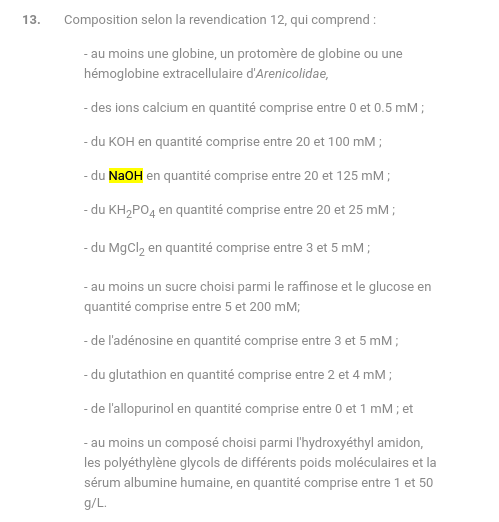

# Dominique's secret product 2/2

**Category** : World 3
**Points** : 372

Well done, now we need you to find the name of their best product and the concentration range of the NaOH molecule at the heart of its flagship product.

Flag format : ```ECTF{product:XX-XXX}```
Flag is not case sensitive ;)
**Author: Hippie Osy_Ris**

On recherche une quantité de NaOH dans une solution du produit phare de Hermarina.
en regardant le site web d'hermarina on tombe sur : 
```hemo2live```

Une petite recherche google sur : ```hemo2live NaOH solution``` nous donne : 

https://patents.google.com/patent/EP2713716B1/fr

une petite recherche sur le document de NaOH nous donne : 


le flag est donc : 

```ECTF{hemo2life:20-125}```

