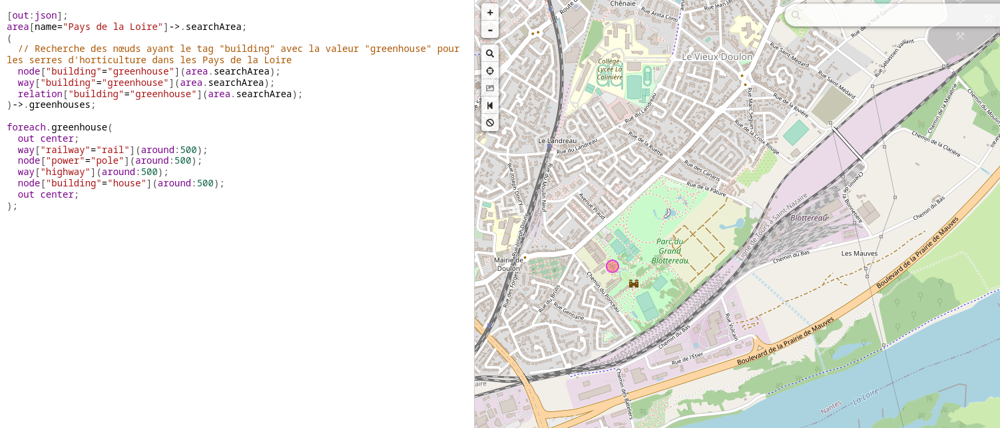
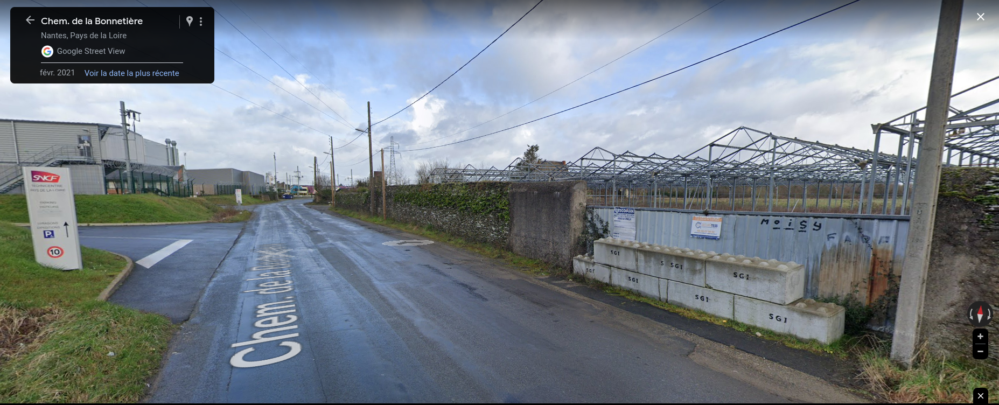

# Mario visits the human kingdom 1/3

**Category** : World 3
**Points** : 436

Luigi has decided to leave the Mushroom Kingdom to devote himself to his true passion: technician.

He sent this picture to his brother Mario and challenged him to find his new workplace.

Mario is not very good in OSINT and asked you to help him to find the coordinates of his brother's workplace so that he could visit him.

Flag format : ```ECTF{latitude:longitude}```

**Author: Osy_Ris**

## Files : 
 - [Greenhouses.png](./Greenhouses.png)


Après analyse de l'énoncé et de l'image on se dit qu'il faut chercher une serre ( greenhouse) a coté une voie de la sncf avec un pilone électrique et des habitations.

De plus en analysant la photo nos aprenons que le numéro de téléphone de la socièté sécuri-tess comment par : 02 28

la page : https://fr.wikipedia.org/wiki/Indicatif_t%C3%A9l%C3%A9phonique_local_en_France nous confirme que nous somme en loire atlantique ( où Vendée).

Et c'est à https://overpass-turbo.eu/ de rentré en jeu avec cette requette (merci chatGPT)
```
[out:json];
area[name="Pays de la Loire"]->.searchArea;
(
  // Recherche des nœuds ayant le tag "building" avec la valeur "greenhouse" pour les serres d'horticulture dans les Pays de la Loire
  node["building"="greenhouse"](area.searchArea);
  way["building"="greenhouse"](area.searchArea);
  relation["building"="greenhouse"](area.searchArea);
)->.greenhouses;

foreach.greenhouse(
  out center;
  way["railway"="rail"](around:500);
  node["power"="pole"](around:500);
  way["highway"](around:500);
  node["building"="house"](around:500);
  out center;
);
```



le résultat est pas très concluant. Mais en regardant bien on voit : 

* une concentration de voie a droite
* une ligne a haute entesion passé au dessus
* un batiment
* et le chemin tourne comme sur la photo

allons voir sur google map en prenant une photo prise en 2021 ( il y avait l'année sur l'image du chall en filigram): 



cela confirme bien le lieu.
reste la position exacte.

Une recherche google nous donne ce site : 
https://data.opendatasoft.com/explore/dataset/sites-de-livraison-sncf-ti-geoparts-v2%40datasncf/table/?flg=fr

dans ce tableau on a pour le technicentre loire atlantique : 

Le flag : ```ECTF{47.229889,-1.497611}```

