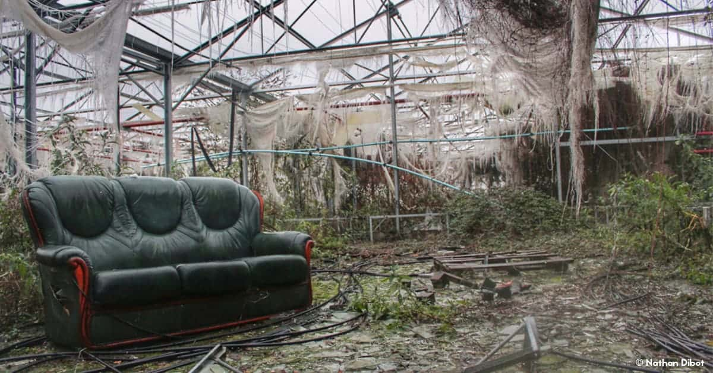
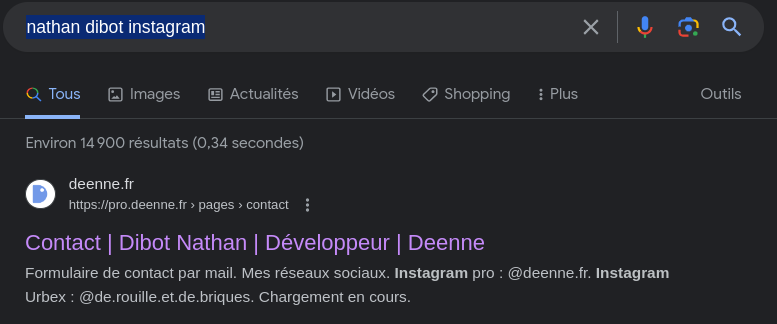

# Mario visits the human kingdom 2/3

**Category** : World 3
**Points** : 489

Mario remembers seeing these greenhouses when he was hunting Boos with his brother.

That day they had even helped a person to take a picture of a sofa in this gloomy atmosphere.

Unfortunately, Mario does not remember the name of this person.

He asks for your help to find the Instagram account where this person could have posted the picture taken that day.

Flag format : ```ECTF{instagram_account_name}```

**Author: Osy_Ris**


Avec une recherche google : serre(greenhouse) fantome(boos = fantome) nantes"

un tombe sur ce lien :
https://www.bigcitylife.fr/top/top-urbex-2020-meilleurs-spots-nantes-alentours/

et on découvre cette photo qui à l'EST de NANTES ( comme notre zone)



Sur la photo il y a un nom : Nathan Dibot

une recherche google ```nathan dibot instagram```nous donne : 




Le flag est : ```ECTF{de.rouille.et.de.briques}```
