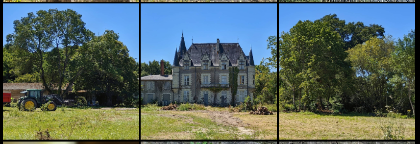
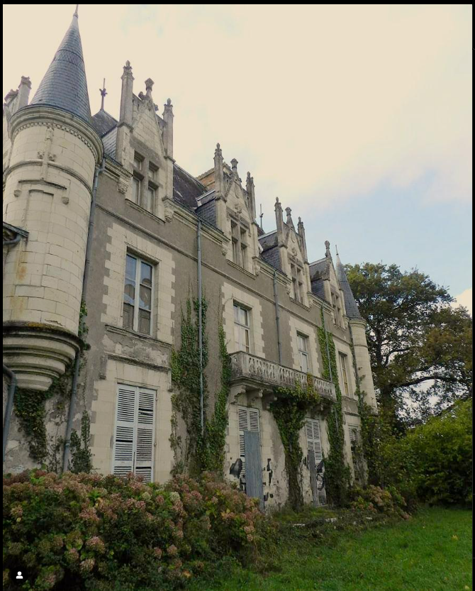
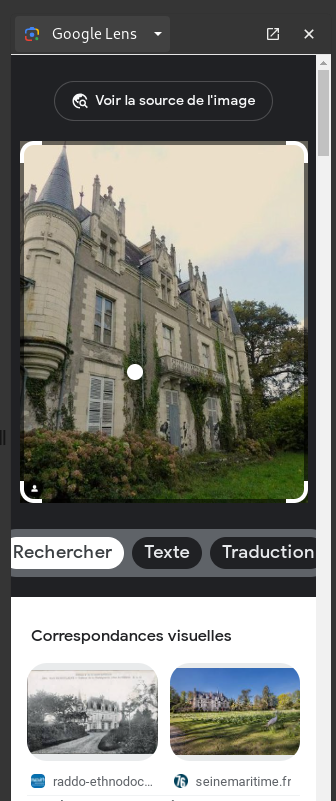
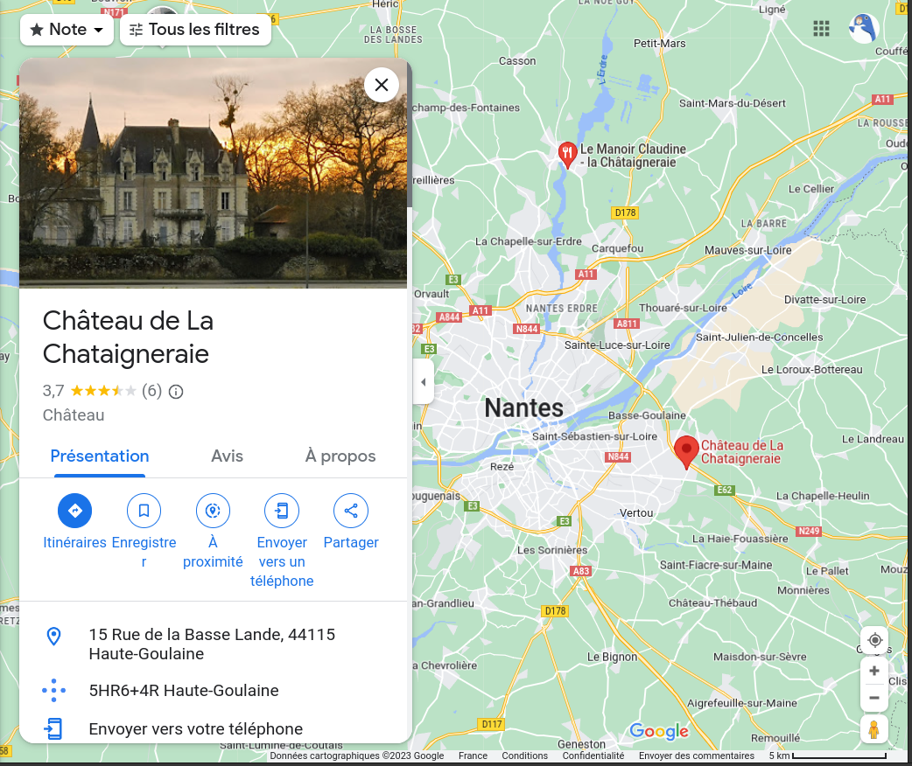

# Mario visits the human kingdom 3/3

**Category** : World 3
**Points** : 499

While scrolling through the de.rouille.et.de.briques Instagram account, Mario found a three-towered castle that Princess Peach might like.

Unfortunately he can't figure out the name of it.

Could you help him find the name and address of the castle?

Flag format : ```ECTF{castle_name:address}```

Flag example : ```ECTF{chateau_de_versailles:2_rue_des_champignons_75000_paris}```

**Author: Osy_Ris**

en allant sur l'insta on trouve ce chateau qui est le seul avec 3 tours :



le commentaire nous donne une fausse piste : ```chateau de lacie```

mais en cherchant des hashtag comme #urbex nantes, on tombe sur ce compte : 

https://www.instagram.com/urbex.west/

avec le meme chateau :


et avec une recherche inverse par zone de ce chateau on tombe sur : 



le lien : 
https://raddo-ethnodoc.com/raddo/document/77624

nous indique que c'est le ```chateau de la chataigneraie```

Une recherche map pour avoir l'adress donne : 



le flag est : ```ECTF{chateau_de_la_chataigneraie:15_rue_de_la_basse_lande_44115_haute-goulaine}```

