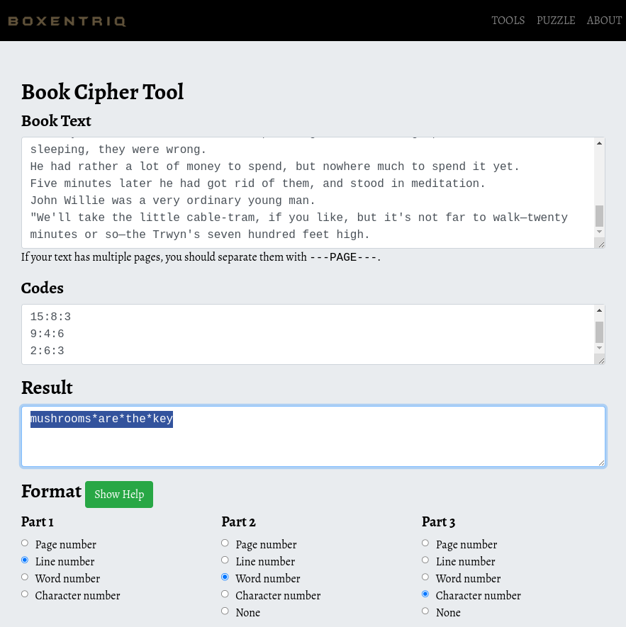

# Writers' encryption

**Category** : World 3
**Points** : 493

Bowser has implemented a new encryption system to communicate securely with his henchmen.

You have managed to intercept an exchange using this new system.

Decode the message that has been encrypted.

**Author: Osy_Ris**

## Files : 
 - [message_to_the_koopas.zip](./message_to_the_koopas.zip)


Ayant perdu trop de temps sur minecraft je comprends vite que les info sont dans les NBT.
Sauf que si c'est dans les fichiers du monde trouver l'info va etre difficile.
Je décide donc de lancer minecraft et importer la savegarde et je découvre un joli monde :

et devant le joueur il y a 2 livres.
Je les prends dans mon inventaire et quite le jeu.

Puis avec : https://irath96.github.io/webNBT/ j'édite la savegarde et le dat du joueur afin de lire son inventaire et extraire les tag des livre ce qui me donne :

```
6:2:4
2:8:2
15:10:3
4:34:1
1:10:4
7:11:2
13:11:4
14:8:1
3:2:1
_
5:26:4
10:4:10
9:4:6
_
12:10:3
8:1:2
11:17:4
_
15:8:3
9:4:6
2:6:3
```
et 
```
On a Friday afternoon in the June of the year 1880, a roomy old shandrydan, midway between a trap and a wagonette, moved slowly along the Porth Neigr and Llanyglo road.
The day was warm, and hay was cutting.
The shaky-kneed old brown animal at present between the shafts might have had a spirit-level inside him, so unerringly did he become aware when the road departed by as much as a fraction from the true horizontal.
Leaving the cluster of three or four farms that formed the land-ward part of Llanyglo, they had turned through a gateless gap in a thymy earth-wall, and all save Mrs. Garden and Minetta had descended.
Mrs. Garden had descended, and stood over her neat boot-tops in sand, wondering which of her cramped members it would be best to try to straighten first.
He beamed on each of them, and then beamed on them again.
"Aw-w-w, no!" he said. "Indeed it is very good of you, and I am very pleased you show so much confidence in me, but it would not do.
This puzzled Terry.
No doubt the Squire said it without accepting too much responsibility for it.
They were not notice-boards and gates—they were the insulting tokens of invasion and rapine and defeat.
If they had assumed that the Kerrs, having worked all night, would now be sleeping, they were wrong.
He had rather a lot of money to spend, but nowhere much to spend it yet.
Five minutes later he had got rid of them, and stood in meditation.
John Willie was a very ordinary young man.
"We'll take the little cable-tram, if you like, but it's not far to walk—twenty minutes or so—the Trwyn's seven hundred feet high.
```
Nous sommes en présence d'un book cypher, je passe les donné dans la moulinette de ce site : 
https://www.boxentriq.com/code-breaking/book-cipher



Le flag est : ```ECTF{mushrooms_are_the_key}
