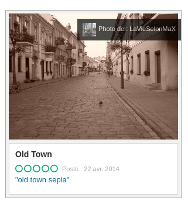

# Wrong Kingdom

**Category** : World 4
**Points** : 387

During his odyssey, Mario used the magic hat Cappy to travel between kingdoms. After visiting New Donk City, he arrived in an unknown realm and took this picture before posting it on the so-called internet. Find the name of the city of this photo and the date it's date of publication to help Mario to find his way back!

Flag format : ```ECTF{City:YYYY-MM-DD}```

**Author: Hippie**

## Files : 
 - [49a532e2-ed7d-4617-af05-272c1bcc8ac5.jpeg](./49a532e2-ed7d-4617-af05-272c1bcc8ac5.jpeg)


en faisant une recherche google image "afficher la source" on tombe sur un poste de trip advisor :

https://www.tripadvisor.ru/LocationPhotoDirectLink-g274948-d3138362-i96639453-Old_Town-Kaunas_Kaunas_County.html

La photo a été prise dans la ville de Kaunas

Et là l'enfer a commencé j'ai recherché toutes les photos de cette ville : kaunas présent sur tripadvisor ( 1321).

Mais via cet enfer on découvre tout de meme que c'est la rue : vilniaus gatvé.

et on découvre que c'est l'utilisateur : 
* la vie selon MaX 
* qui a prise cette photo en 2014.

https://www.tripadvisor.fr/Profile/LaVieSelonMaX?fid=71a76206-77d0-43c2-96cb-234bc773a934


on va sur members-citypage on a : 

https://www.tripadvisor.fr/members-citypage/LaVieSelonMaX/g274948 : 



le flag est : ```ECTF{Kaunas:2014-04-22}```

